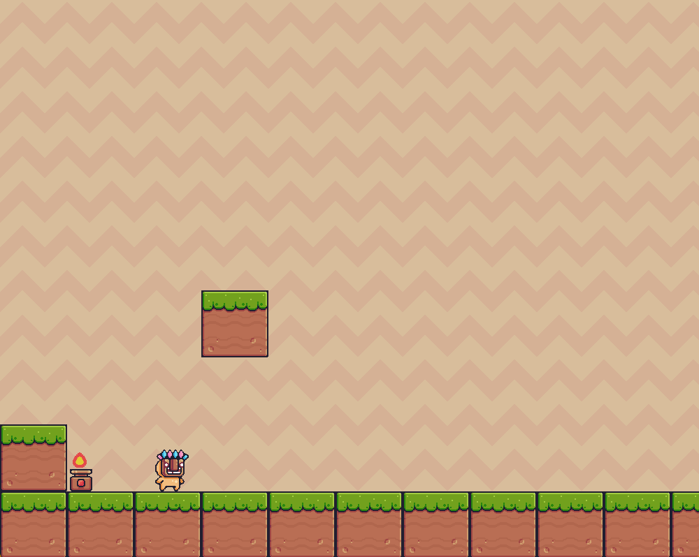

# Python Platformer Game

A small 2D platformer built with Python and Pygame. The project demonstrates core platformer mechanics, including player movement, collision detection, animation handling, level rendering, a side-scrolling camera, and game loop implementation.



## Tech Stack

- Python
- Pygame

## Features

- 2D player movement and controls
- Jumping and double-jump mechanics
- Sprite-based character animations
- Platform and object collision detection
- Side-scrolling camera system
- Terrain, traps, and environmental objects
- Game loop and real-time rendering

## Requirements

You need Python installed on your computer.

This project also requires Pygame:

```powershell
py -m pip install pygame
```

If your system uses `python` instead of `py`, use:

```powershell
python -m pip install pygame
```

## How to Run

Open a terminal in the project folder:

```powershell
cd Pygame-Platformer
```

Then launch the game:

```powershell
py Pygame.py
```

Or, if your system uses `python`:

```powershell
python Pygame.py
```

Make sure you run the command from the project folder. The game loads images from the local `assets` folder, so running it from somewhere else can cause missing file errors.

## Controls

| Key | Action |
| --- | --- |
| Left Arrow | Move left |
| Right Arrow | Move right |
| Space | Jump / double jump |
| Close Window | Quit the game |

## Project Structure

```text
Pygame-Platformer/
|-- Pygame.py
|-- README.md
|-- preview.png
`-- assets/
```

`Pygame.py` contains the main game code, including the player class, object classes, collision logic, drawing functions, and game loop.

`assets/` contains the images and sprite sheets used by the game.

## Troubleshooting

If you see this error:

```text
ModuleNotFoundError: No module named 'pygame'
```

Install Pygame with:

```powershell
py -m pip install pygame
```

If the game opens but images are missing, check that you are running the file from inside the project folder, not from another directory.
